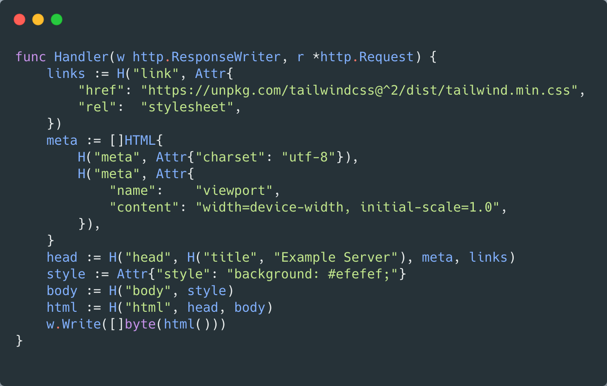

# daz
[](https://godoc.org/github.com/stevelacy/daz)

> Composable HTML components in Golang



Daz is a "functional" alternative to using templates, and allows for nested components/lists
Also enables template-free server-side rendered components with support for nested lists. It is inspired by [HyperScript](https://github.com/hyperhype/hyperscript).


A component can be created and used with simple functions:
```golang
	element := H("div", Attr{"class": "bg-grey-50"})

	html := H("html", element)

	w.Write([]byte(html()))
```

Lists can be easily created without needing to embed a `range / end` in a template:
```golang
	items := []func() string{H("li", "item one"), H("li", "item two")}

	element := H("ul", Attr{"class": "bg-grey-50"})

	div := H("div", element)

```


### Install

```
import (
	"github.com/stevelacy/daz"
)

```

### Usage

#### func `H`

Create a HTML element:
```golang
H("div", ...attrs)

```

#### struct `Attr`

HTML attributes:
```golang
Attr{
	"class": "app",
	"onClick": "javascriptFunc()",
}
```
